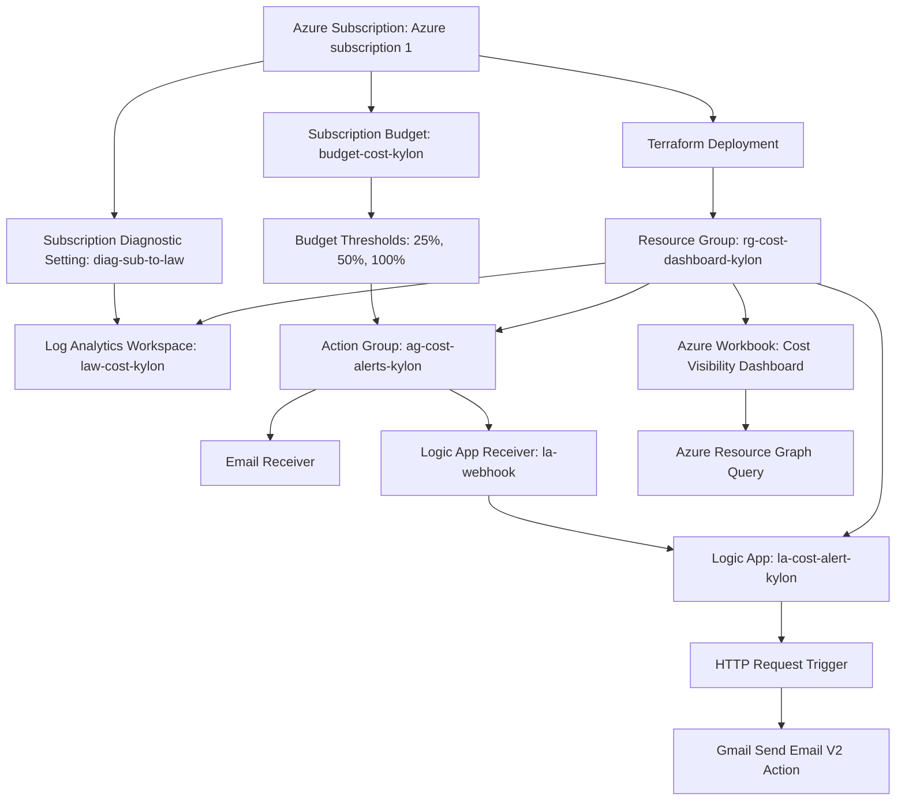
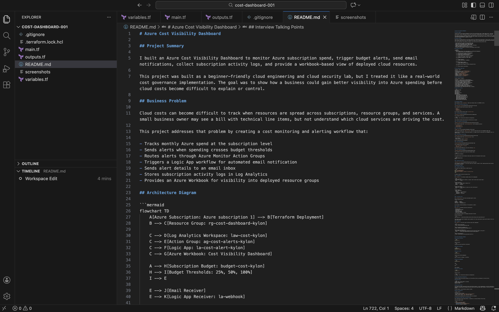
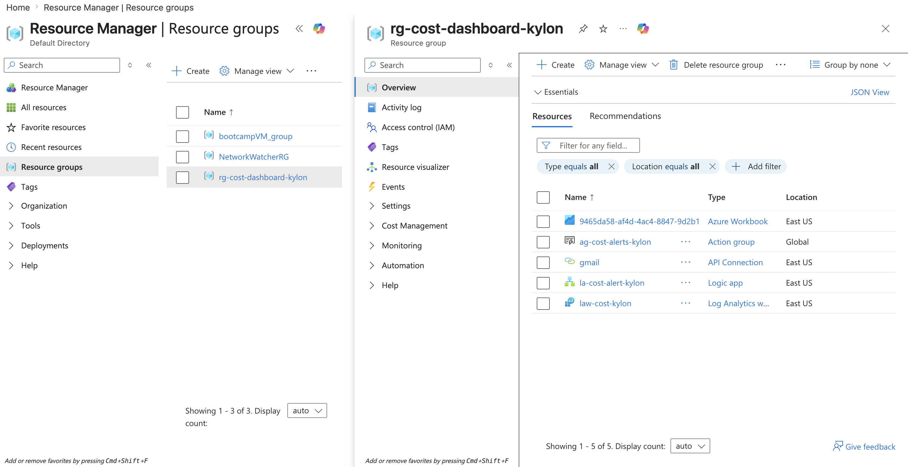
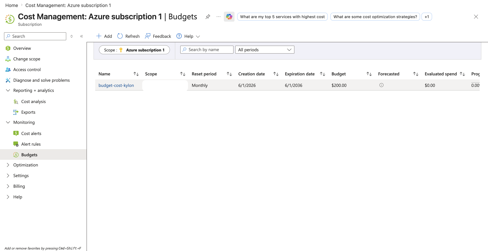
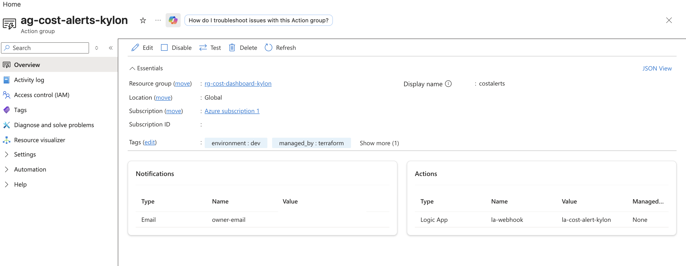
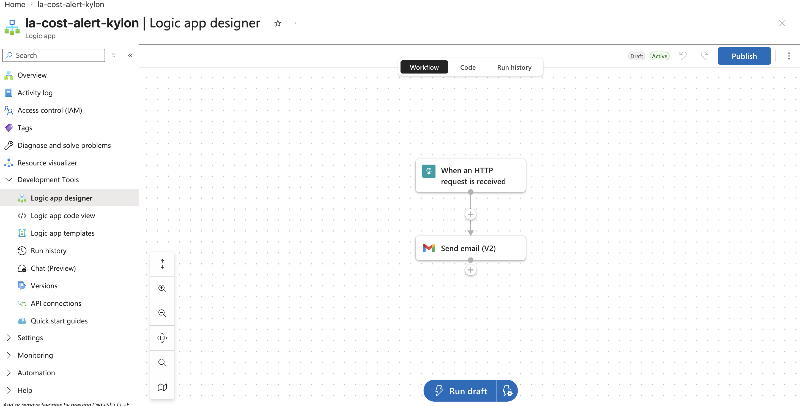
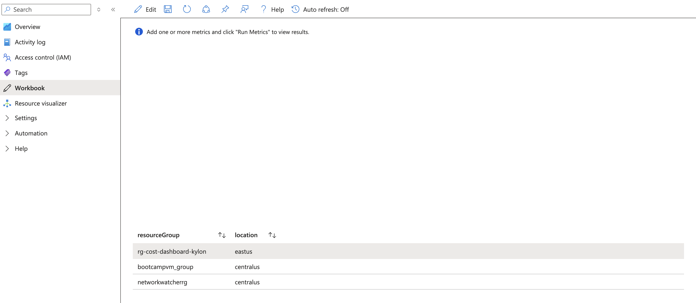

# Azure Cost Visibility Dashboard

## Project Summary

I built an Azure Cost Visibility Dashboard to monitor Azure subscription spend, trigger budget alerts, send email notifications, collect subscription activity logs, and provide a workbook-based view of deployed cloud resources.

This project was built as a beginner-friendly cloud engineering and cloud security lab, but I treated it like a real-world cost governance implementation. The goal was to show how a business could gain better visibility into Azure spending before cloud costs become difficult to explain or control.

## Business Problem

Cloud costs can become difficult to track when resources are spread across subscriptions, resource groups, and services. A small business owner may see a bill with technical line items, but not understand which cloud services are driving the cost.

This project addresses that problem by creating a cost monitoring and alerting workflow that:

- Tracks monthly Azure spend at the subscription level
- Sends alerts when spending crosses budget thresholds
- Routes alerts through Azure Monitor Action Groups
- Triggers a Logic App workflow for automated email notification
- Sends alert details to an email inbox
- Stores subscription activity logs in Log Analytics
- Provides an Azure Workbook for visibility into deployed resource groups

## Architecture Diagram



## Final Resource Names Used

| Resource | Name |
|---|---|
| Resource Group | `rg-cost-dashboard-kylon` |
| Log Analytics Workspace | `law-cost-kylon` |
| Action Group | `ag-cost-alerts-kylon` |
| Logic App | `la-cost-alert-kylon` |
| Budget | `budget-cost-kylon` |
| Diagnostic Setting | `diag-sub-to-law` |
| Workbook | `Cost Visibility Dashboard` |
| Logic App Receiver | `la-webhook` |

## Tools and Services Used

| Tool / Service | Purpose |
|---|---|
| Terraform | Infrastructure as Code deployment |
| Azure CLI | Authentication and Action Group updates |
| Visual Studio Code | Terraform code editing |
| zsh Terminal | Command execution on macOS |
| Azure Cost Management | Budget and cost alerting |
| Azure Monitor Action Groups | Alert routing |
| Azure Logic Apps | Workflow automation |
| Gmail Connector | Email alert delivery |
| Log Analytics Workspace | Central log collection |
| Azure Workbooks | Dashboard and reporting |
| Azure Resource Graph | Querying Azure resource metadata |

## Repository Structure

```text
cost-dashboard-001/
├── main.tf
├── variables.tf
├── outputs.tf
├──terraform.tfvars.example
└──  terraform.tfvars is used locally but excluded from GitHub using .gitignore.
├── README.md
└── screenshots/
    ├── 01-vscode-project-files.png
    ├── 02-terraform-no-changes.png
    ├── 03-resource-group-overview.png
    ├── 04-budget-cost-kylon.png
    ├── 05-action-group-receivers.png
    ├── 06-logic-app-designer.png
    ├── 07-workbook-dashboard.png
```

## Screenshot Evidence

Add screenshots to the `screenshots/` folder and reference them in the README like this.

### 1. VS Code Terraform Project Files



This screenshot should show the project folder with:

- `main.tf`
- `variables.tf`
- `outputs.tf`

Do not expose sensitive values inside `terraform.tfvars`.

### 2. Terraform State Verification


This screenshot should show:

```text
No changes. Your infrastructure matches the configuration.
```

This confirms Terraform state and Azure infrastructure are synced.

### 3. Azure Resource Group Overview



This screenshot should show `rg-cost-dashboard-kylon` and the deployed resources:

- `la-cost-alert-kylon`
- `law-cost-kylon`
- `ag-cost-alerts-kylon`

### 4. Azure Budget



This screenshot should show `budget-cost-kylon` under the subscription-level Cost Management budget page.

Important note: this budget is subscription-scoped, so it appears under the subscription Cost Management view, not inside the resource group.

### 5. Azure Monitor Action Group



This screenshot should show `ag-cost-alerts-kylon` with:

- Email receiver
- Logic App receiver named `la-webhook`

Blur or hide personal email addresses.

### 6. Logic App Designer



This screenshot should show the workflow:

- `When an HTTP request is received`
- `Send email (V2)`

Do not show the HTTP POST URL or any value containing `sig=`.

### 7. Azure Workbook Dashboard



This screenshot should show the saved Azure Workbook named:

```text
Cost Visibility Dashboard
```

The workbook should show the Resource Graph query output with the deployed resource group:

```text
rg-cost-dashboard-kylon
eastus
```

## Implementation Steps

### 1. Project Folder Setup

The project was created locally on macOS using zsh.

```bash
mkdir ~/cost-dashboard-001
cd ~/cost-dashboard-001
touch main.tf variables.tf outputs.tf terraform.tfvars
code .
```

VS Code was used to edit the Terraform files.

### 2. variables.tf

The `variables.tf` file defines reusable values for the deployment.

```hcl
variable "yourname" {
  description = "Your name, lowercase, no spaces. Used to make resource names unique."
  type        = string
}

variable "location" {
  description = "Azure region to deploy into."
  type        = string
  default     = "East US"
}

variable "alert_email" {
  description = "Email address to receive cost alert notifications."
  type        = string
}

variable "tags" {
  type = map(string)
  default = {
    project     = "cost-dashboard"
    environment = "dev"
    managed_by  = "terraform"
  }
}
```

### 3. terraform.tfvars

The `terraform.tfvars` file stores environment-specific values.

Example sanitized version:

```hcl
yourname    = "kylon"
location    = "East US"
alert_email = "user@example.com"
```

Do not commit real email addresses if the repository is public.

### 4. main.tf

The `main.tf` file deploys the Azure infrastructure:

- Resource group
- Log Analytics Workspace
- Action Group
- Subscription budget
- Logic App container
- Subscription diagnostic setting

A key adjustment was made to the budget subscription ID format.

Working configuration:

```hcl
subscription_id = "/subscriptions/${data.azurerm_client_config.current.subscription_id}"
```

This fixed an issue where the budget resource expected a full Azure subscription resource path instead of only the raw subscription GUID.

### 5. outputs.tf

The `outputs.tf` file prints useful Terraform values after deployment:

```hcl
output "resource_group_name" {
  value = azurerm_resource_group.main.name
}

output "log_analytics_workspace_id" {
  value = azurerm_log_analytics_workspace.main.id
}

output "logic_app_callback_url" {
  description = "Use this URL when configuring the Logic App HTTP trigger in the portal."
  value       = azurerm_logic_app_workflow.cost_alert.access_endpoint
}

output "action_group_id" {
  value = azurerm_monitor_action_group.email_alerts.id
}
```

## Terraform Deployment Commands

### Initialize Terraform

```bash
terraform init
```

Expected result:

```text
Terraform has been successfully initialized!
```

### Format and Validate

```bash
terraform fmt
terraform validate
```

### Review the Plan

```bash
terraform plan
```

Expected result before deployment:

```text
Plan: 6 to add, 0 to change, 0 to destroy.
```

### Apply the Deployment

```bash
terraform apply
```

Type:

```text
yes
```

when prompted.

### Confirm Final State

```bash
terraform plan
```

Expected result:

```text
No changes. Your infrastructure matches the configuration.
```

## Logic App Workflow Configuration

Terraform created the Logic App container, but the workflow itself was configured in the Azure Portal.

### Workflow Used

```text
Trigger: When an HTTP request is received
Action: Send email (V2)
Connector: Gmail
```

### Why Gmail Was Used

The original lab steps referenced the Office 365 Outlook connector. In this implementation, the Office 365 Outlook connection returned an unauthorized error because the Azure account used a Gmail-based login instead of a Microsoft 365 work or school mailbox.

To move forward, I used the Gmail connector instead.

### Email Configuration

| Field | Value |
|---|---|
| To | Personal alert email |
| Subject | `Azure Cost Alert — Budget Threshold Reached` |
| Body | Dynamic content: `Body` from HTTP trigger |

The workflow was published after the email action was configured.

## Connecting the Logic App to the Action Group

After publishing the Logic App workflow, I connected it to the Azure Monitor Action Group.

Sanitized command format:

```bash
az monitor action-group update \
  --name ag-cost-alerts-kylon \
  --resource-group rg-cost-dashboard-kylon \
  --add-action logicapp la-webhook \
  "/subscriptions/SUBSCRIPTION_ID/resourceGroups/rg-cost-dashboard-kylon/providers/Microsoft.Logic/workflows/la-cost-alert-kylon" \
  "LOGIC_APP_CALLBACK_URL"
```

Verification command:

```bash
az monitor action-group show \
  --name ag-cost-alerts-kylon \
  --resource-group rg-cost-dashboard-kylon \
  --query "logicAppReceivers"
```

Expected output includes:

```json
[
  {
    "name": "la-webhook",
    "resourceId": "/subscriptions/SUBSCRIPTION_ID/resourceGroups/rg-cost-dashboard-kylon/providers/Microsoft.Logic/workflows/la-cost-alert-kylon"
  }
]
```

## Azure Workbook Dashboard

The workbook was created in Azure Monitor and saved as:

```text
Cost Visibility Dashboard
```

### Resource Graph Query Used

```kusto
resourcecontainers
| where type == "microsoft.resources/subscriptions/resourcegroups"
| project resourceGroup, location
```

This query displayed resource groups and their Azure regions, including:

```text
rg-cost-dashboard-kylon    eastus
```

### Note About Cost Management Metrics

During implementation, the Azure Portal did not show Cost Management as an available metric resource type in the Workbook metric editor. Instead of blocking the project, I saved the workbook with the Azure Resource Graph query that verified deployed resource group visibility.

This was documented as a portal UI difference and practical workaround.

## Troubleshooting and Fixes

### 1. Terminal Prompt Confusion

Early in the setup, I accidentally typed tutorial prompt symbols like `$` and `#` into the terminal.

Lesson learned:

- `$`, `%`, and `#` in tutorials are usually prompt symbols or comments.
- Only the actual command should be typed.

Example:

```bash
brew --version
```

not:

```bash
$ brew --version
```

### 2. Confirming Homebrew

Homebrew was confirmed installed:

```text
Homebrew 5.0.13
```

### 3. Shell Used

The terminal was using zsh, which is normal for modern macOS.

```bash
echo $SHELL
```

Expected output:

```text
/bin/zsh
```

### 4. Terraform Provider Download Timeout

During `terraform init`, the provider download initially failed with a timeout.

Resolution:

```bash
terraform init
```

was rerun successfully.

### 5. Budget Subscription ID Error

Terraform returned an error because the budget resource expected a full subscription path.

Incorrect format:

```hcl
subscription_id = data.azurerm_client_config.current.subscription_id
```

Correct format:

```hcl
subscription_id = "/subscriptions/${data.azurerm_client_config.current.subscription_id}"
```

### 6. Diagnostic Setting State Issue

Terraform created the diagnostic setting in Azure but failed to save it into Terraform state due to a provider inconsistency.

Error summary:

```text
Provider produced inconsistent result after apply
```

Then a second apply showed:

```text
A resource with the ID already exists
```

Resolution:

```bash
terraform import azurerm_monitor_diagnostic_setting.subscription_logs "/subscriptions/SUBSCRIPTION_ID|diag-sub-to-law"
terraform plan
```

Expected result after import:

```text
No changes. Your infrastructure matches the configuration.
```

### 7. Office 365 Outlook Unauthorized Error

The Office 365 Outlook connector failed with an unauthorized error. This happened because the account used was not a Microsoft 365 work or school mailbox.

Resolution:

- Removed the Office 365 Outlook action
- Added the Gmail connector
- Signed in with Gmail
- Granted the requested permission
- Added the HTTP trigger body as dynamic content in the email body
- Published the Logic App

### 8. Action Group Command Formatting

The Action Group command initially failed due to formatting issues:

- Extra Logic App name argument
- Misplaced backslashes
- Incorrect use of `$` before a manually typed subscription ID

Working pattern:

```bash
az monitor action-group update \
  --name ag-cost-alerts-kylon \
  --resource-group rg-cost-dashboard-kylon \
  --add-action logicapp la-webhook \
  "/subscriptions/SUBSCRIPTION_ID/resourceGroups/rg-cost-dashboard-kylon/providers/Microsoft.Logic/workflows/la-cost-alert-kylon" \
  "LOGIC_APP_CALLBACK_URL"
```

### 9. Budget Portal Location

The budget did not appear inside the resource group because it was created at the subscription scope.

Correct portal path:

```text
Subscriptions → Azure subscription 1 → Cost Management → Budgets → budget-cost-kylon
```

## Verification Checklist

| Check | Result |
|---|---|
| Terraform initialized successfully | Complete |
| Terraform deployment completed | Complete |
| Diagnostic setting imported into state | Complete |
| Terraform state shows no changes | Complete |
| Resource group exists | Complete |
| Log Analytics Workspace exists | Complete |
| Budget exists in subscription Cost Management | Complete |
| Action Group exists | Complete |
| Logic App exists | Complete |
| Logic App has HTTP trigger | Complete |
| Logic App has Gmail send email action | Complete |
| Logic App receiver connected to Action Group | Complete |
| Workbook saved as Cost Visibility Dashboard | Complete |

## Security Considerations

This project includes several security and governance lessons.

### Protect Callback URLs

Logic App callback URLs contain a `sig=` value. This value acts like a secret. Anyone with the URL may be able to trigger the workflow.

Do not commit or screenshot:

```text
sig=
callbackUrl
HTTP POST URL
```

### Protect Terraform State

Terraform state may contain sensitive infrastructure details. Do not commit:

```text
terraform.tfstate
terraform.tfstate.backup
.terraform/
```

### Protect Personal Information

Do not expose:

```text
Subscription IDs
Tenant IDs
Personal email addresses
Callback URLs
Access tokens
```

### Recommended .gitignore

```gitignore
.terraform/
*.tfstate
*.tfstate.*
terraform.tfvars
*.tfplan
crash.log
crash.*.log
.DS_Store
```

## Cleanup

To remove the deployed resources:

```bash
terraform destroy
```

Type:

```text
yes
```

when prompted.

This will remove Terraform-managed infrastructure and help avoid unnecessary Azure charges.

## Skills Demonstrated

- Terraform Infrastructure as Code
- Azure CLI usage
- Azure Cost Management
- Budget alerting
- Azure Monitor Action Groups
- Logic App workflow automation
- Gmail connector configuration
- Log Analytics setup
- Azure Workbooks
- Azure Resource Graph
- Terraform troubleshooting
- Terraform state import
- Cloud cost governance
- Secure handling of secrets and callback URLs

## Lessons Learned

This project became more valuable because it did not go perfectly on the first try. Real cloud work often involves troubleshooting permissions, provider behavior, portal UI changes, command syntax, and state drift.

Key lessons:

- Terraform files define desired state, while Azure represents actual state.
- If Azure creates something but Terraform does not record it, importing into state may be required.
- Subscription-level resources may not appear inside resource groups.
- Portal UI can differ from lab instructions.
- Alerting workflows should be tested and documented.
- Secrets must be redacted before uploading documentation to GitHub.

## Interview Talking Points

A concise way to explain this project:

> I built an Azure cost visibility and alerting solution using Terraform, Azure Cost Management, Azure Monitor Action Groups, Logic Apps, Gmail notifications, Log Analytics, and Azure Workbooks. The solution tracks subscription-level spend, sends budget threshold alerts, forwards activity logs into Log Analytics, and provides a dashboard view of deployed resources. During the build, I also resolved real-world issues including a Terraform provider state problem, a subscription budget ID formatting issue, and an email connector mismatch.

What this project demonstrates:

- I can deploy Azure infrastructure with Terraform.
- I understand cost governance and cloud billing visibility.
- I can configure alert routing with Azure Monitor.
- I can automate notifications with Logic Apps.
- I can troubleshoot Terraform state and provider issues.
- I know how to document cloud projects clearly and securely.
